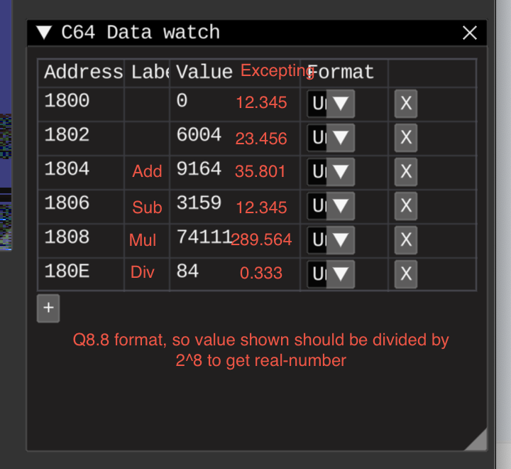

# Fixed point numbers arithmetics



So, now fixed-points in Q8.8 format. Correctly converted:
```
fixedPointIntRepresentation = realNumberInput * 2^n
realNumberInput = fixedPointIntRepresentation / 2^n
```

where `n` is `n` from Qm.n, so in my case Q8.8 n=8

## Multiplication 
Implemented using https://codebase64.org/doku.php?id=base:16bit_multiplication_32-bit_product
Should research inner details later

So, example multiplication:  
`12.345 * 23.456 = 289.56432`  
in integer forms are:  
`3160 * 6004 = 18972640`  
after scaling result down because point has moved n steps left as a result of multiplication(see [wiki](https://en.wikibooks.org/wiki/Floating_Point/Fixed-Point_Numbers#Arithmetic))
`3160 * 6004 = 74128`   

and the final result is:   
`74111` in integer or
`289.49609`

Kinda close, but not really, to the expected `289.56432`

Totally should use more bits for fractional part, Q0.15 recommended for the sine tables

## Division
Implemented using https://codebase64.org/doku.php?id=base:16bit_division_16-bit_result

Can't divide 1 by 3 to get 0.33(3), result is zero, remainder. Not sure if expected behaviour or not, not sure how to use remainder

Should convert dividend to lower scaling base?
https://en.wikipedia.org/wiki/Fixed-point_arithmetic#Division
> For example, if r = 1.23 is represented as 123 with scaling 1/100, and s = 6.25 is represented as 6250 with scaling 1/1000, then simple division of the integers yields 123÷6250 = 0 (rounded) with scaling factor (1/100)/(1/1000) = 10. If r is first converted to 1,230,000 with scaling factor 1/1000000, the result will be 1,230,000÷6250 = 197 (rounded) with scale factor 1/1000 (0.197). The exact value 1.23/6.25 is 0.1968.
> To convert a number from a fixed point type with scaling factor R to another type with scaling factor S, the underlying integer must be multiplied by the ratio R/S. Thus, for example, to convert the value 1.23 = 123/100 from scaling factor R=1/100 to one with scaling factor S=1/1000, the integer 123 must be multiplied by (1/100)/(1/1000) = 10, yielding the representation 1230/1000.

UPD: yes, scaling down helps, but overflows might be a problem later.
