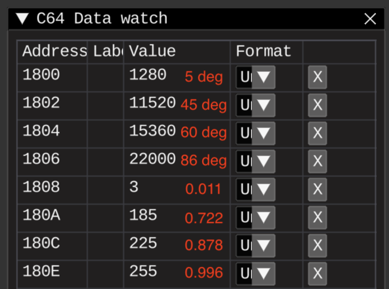

# Sine table

So, sine-table generation using parabola approximation suggested [here](https://en.wikibooks.org/wiki/Floating_Point/Fixed-Point_Numbers#Sine_table).
> `sin(A) ~= 1-((A-90)/90)^2` with a maximum error of less than 0.06 when 0 <= A <= 180  
> `cos(A) ~= 1-(A/90)^2` with a maximum error of less than 0.06 when -90 <= A <= 90

## Notes:
* Not sure why, but 0 and 90 degrees overflows 16-bit result. So, example using 5 degree and 86 degree for these low/high values
* `(A - 90) / 90` replaced with `(A - 90) * (1 / 90)`

## Summary
* Should try to lower values in formulas with scaling down input degrees
* Should try to use another fixed-point format
* Should implement rescale funcs, up and down 
