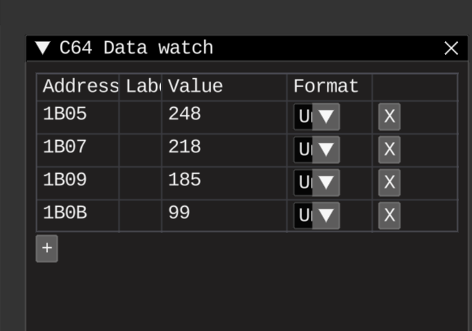

# Sine table continued

## Tasks
* Generate full sine func/macro

## Results

* Lower values in formulas with scaling down input degrees
* Implemented rescale funcs, up and down
* Separate library for 16-bit arith and fp, sine also