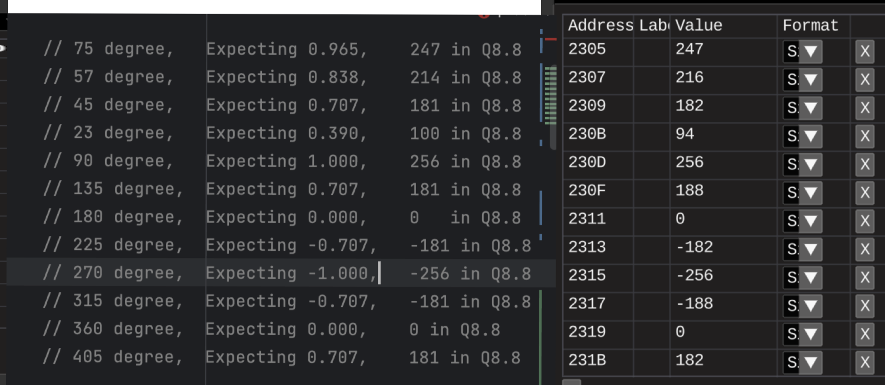

# Sine table continued

## Tasks
* Should try to lower values in formulas with scaling down input degrees
* Should try to use another fixed-point format
* Should implement rescale funcs, up and down 
