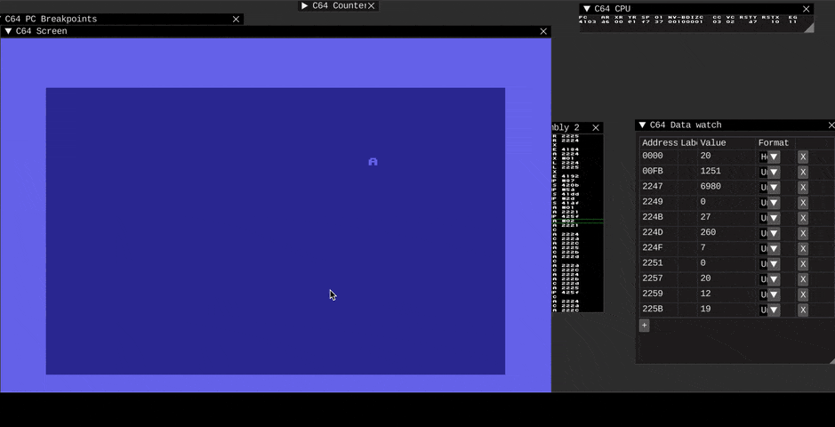
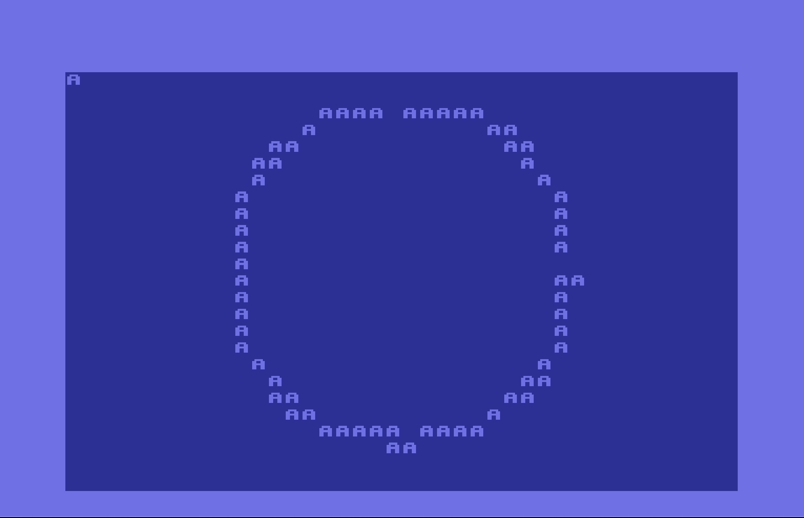

# Sine table continued

## Tasks
* Circle with letter A on screen

## Results

### Circle not really a circle, with artifacts. Artifacts source is Q8.8 fp format, I guess

## Next 
* Should try to use another fixed-point format