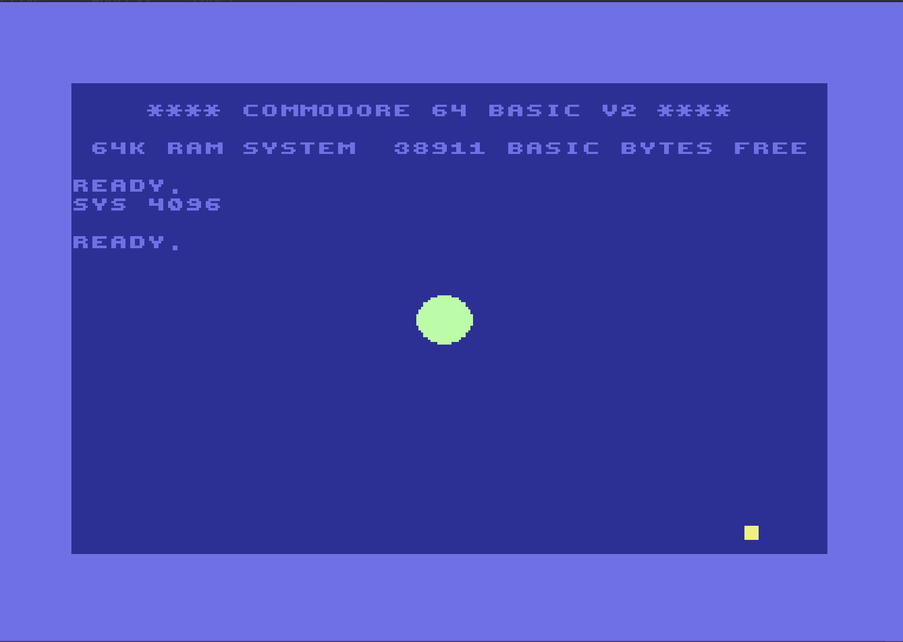

# Sprite basics

## Tasks
* Render any sprite

## Results

Two sprites rendered in text-mode with color

## Next

* Move sprite
* Somehow center sprite have something like 160x140 coords on 320x200 screen. Not quite a center, huh. Should research more 