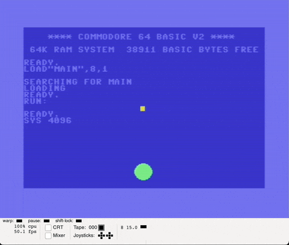

# Sprite circle

## Tasks

* Move sprite
* Somehow center sprite have something like 160x140 coords on 320x200 screen. Not quite a center, huh. Should research more

## Results

First one doesn't look right

After some tuning (word to dword for coordinates)

## Next
* Better accuracy. Q0.16 fixed point format?   