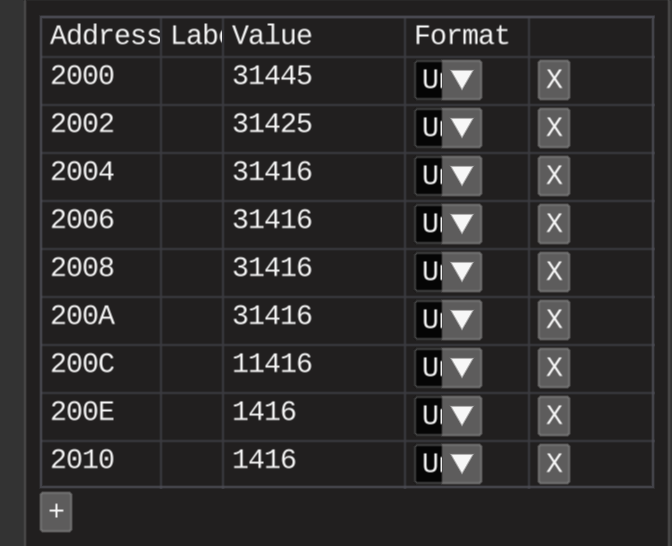
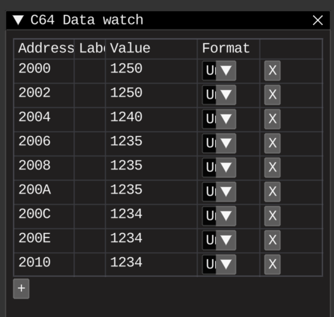

# Fixed point scaling factors demo

## Tasks

* Try different fixed point formats

## Results

### 4 fractional digits of PI
Should be close to 3.14159
From Q8.8 to Q0.16

Results looks similar to [wiki info about scaling factors](https://en.wikipedia.org/wiki/Fixed-point_arithmetic#Choice_of_scaling_factors)

### 4 fractional digits of 0.123456789

Again, as expected