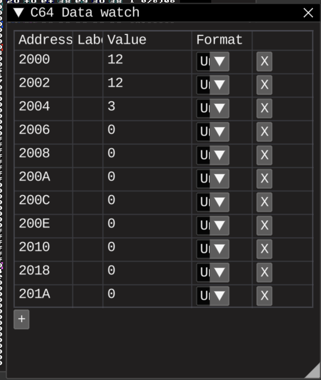

# Fixed point scaling factors demo 2

## Tasks

* Fix previous demo: actual fixed-point arithmetics should be used

## Results

### 4 fractional digits of 0.123456789

#### Multiplication scaling
Multiplication in FP should be scaled back by right-shift. For example:

`1 * 2` in FP Q8.8 is `256 * 512` because:

1 is `1 * 2 ^ 8` and 2 is `2 * 2 ^ 8`

The answer should be 2, in FP Q8.8 `2 * 256 = 512`
So, `256 * 512 = 131072`, and the value is in something like Q0.16 format after scaling it back by right-shifting 8 bits we get 512 again
Explained [here](https://en.wikibooks.org/wiki/Floating_Point/Fixed-Point_Numbers#Arithmetic)

#### Division issues
Still can't divide ints in the FP format while first one is lower than the second one, obliviously
Can't divide 1 by 2 in integer, and still can't divide 256 by 512 in FP Q8.8.

So, internal scaling is used, as explained [here](https://en.wikibooks.org/wiki/Floating_Point/Fixed-Point_Numbers#Arithmetic).

And it's limited to the FP format range

#### Output issues
There is no practical way (for me, for now) to output the fractional digits.

So, I tried to just multiply by powers of 10 to output more digits

As can be seen - intermediate results not quite fit to the FP formats, also explained [here](https://en.wikipedia.org/wiki/Fixed-point_arithmetic#Choice_of_scaling_factors)

#### The actual result

So, first 2 numbers in the formats with the most range. Duh.
