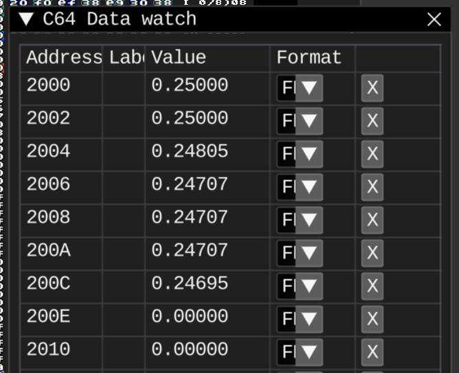
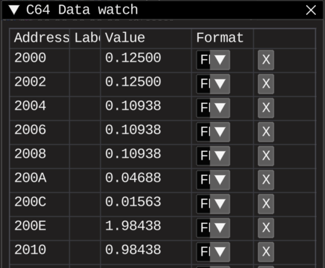
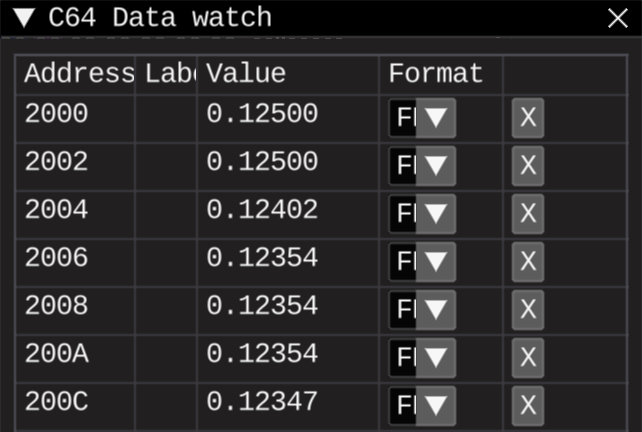

# Fixed point scaling factors demo 2

## Tasks

* Previous demo results with fixed-point results shown in RetroDebugger

## Results

### Fractional digits of 0.123456789

#### Just multiplication by 2
Should be close to 0.246913578

Already can fit Q1.15 and Q0.16, as expected
#### Multiplication by 2 and then division back by 2
Should be close to 0.123456789

Loosing precision on division. Scaling not helping here, making things even worse.
#### Multiplication by 2 and then multiplication by 0.5 
Should be close to 0.123456789

Much better precision, too bad not universal approach