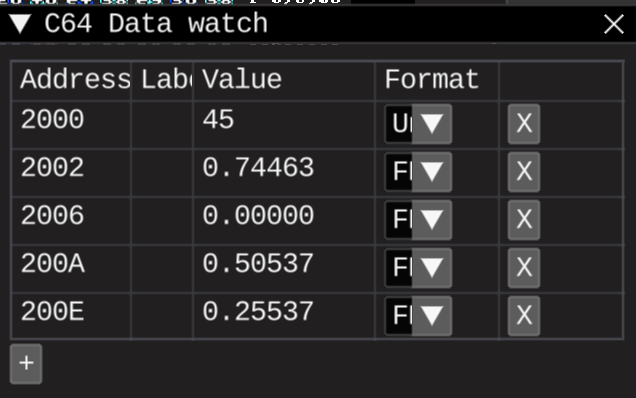

# Sprite circle v2, with fixed fixed-points arithmetics

## Tasks
* Test different fp format for sine table

## Results
All should be close to 0.75
Real sine is 0.7071 but we are using parabola approximation

### Q8.8

### Q3.13
#### Original, with overflowing 16bit intermediate results

Because 1/90 is 92 in Q3.13, and 45 is 368640 (which is already more than 16bit)

And 92 * 368640 is certainly more than 16bit

#### Fixed

Multiplying in simple ints
45 by 92 (0.111 is Q3.13) will give result that already in Q3.13 format, so no need to scale back
And result is certainly can fit into 16 bits 
The result is 0.7446, quite close to expected 0.75