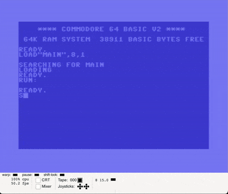
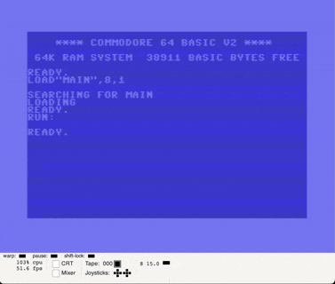

# Sprite circle v2, with fixed fixed-points arithmetics

## Tasks

* Fix strange wiggle around quadrants change, on 0, 90, 180 and 270 degrees 
* Make sine calculated in Q3.13 format
* Make multiplication/shifts work with negative values correctly

## Results

### Fixed strange wiggle

The issue was 1/90 value in sinTable generation

It's value was too inaccurate, and on low values leads to overshooting in parabola calculations
For example, for 88 degrees, the results should be around 0.977
But calculated with 1/90 in Q8.8 it becomes 1.03125, because 1/90 in Q8.8 is 2 or 3.
And parabola approximation becomes negative instead of zero

Tried floor instead of ceil, so 2=0.0078125 in Q8.8 3=0.01171875, expected value 0.0111111111111
So, for example, 88/90 is either 0.6875 or 1.03125, both values are inaccurate

#### Before

#### After

### Q3.13
Can't be implemented without correcting negative multiplication algorithm 