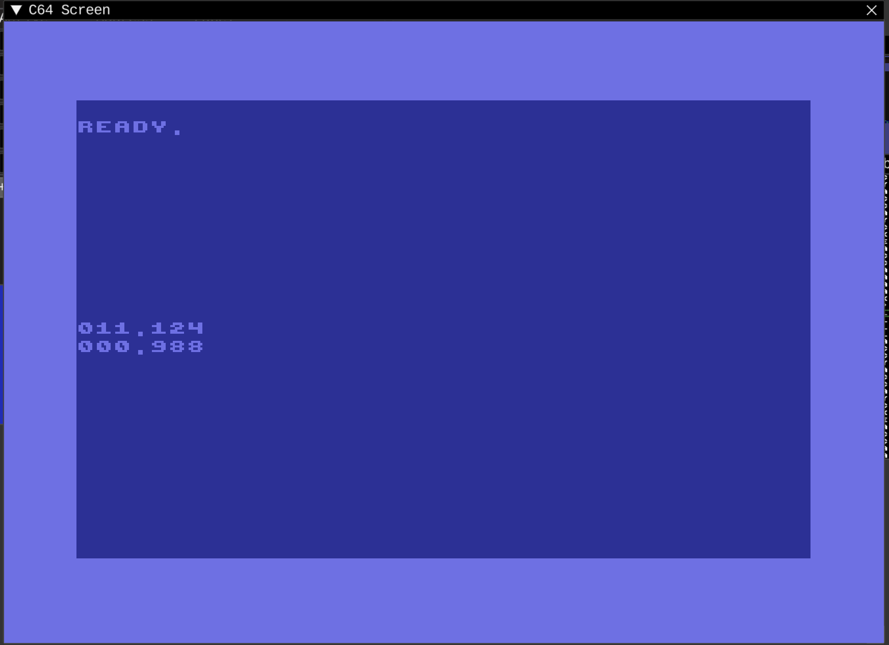

# Output

## Tasks

* Output some fixed-Point sample values on screen

## Results

### It works, but

1. Output works by multiplying by 10 ^ digits, so maximum digits are limited to 32bit result after multiplication. For example, 127 (0.12345 in Q6.10) with 5 digits will become 12700000
2. Output divides resulting int value by 10 and outputting remainder, not the fastest solution. Is there anything else?

#### Multiplication breaks, should debug it

Was expecting to output 5 digits of 0.12345 in Q6.10

Intermediate result should be close to 12700000, and after converting back to int by dividing by 2 ^ 10 i was expecting 12402, but got 4274.

12700000 should fit into 32bit
12402 should fit into 16bit

But something goes wrong, and I got 4376928 after multiplication