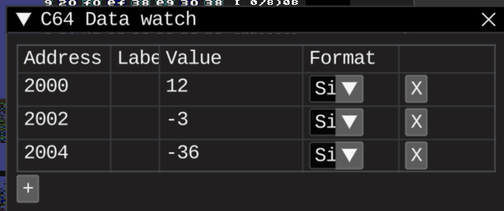

# Negative multiplication research

Multiplication macro only works for unsigned inputs

## Tasks

* Adapt existing mul macro or find some working algorithms

## Results

### Multiplication 
Looks fine, but original values are messed up in the process
Temp variables are used in multiplication to show them

### Shift right

Same values after shifting 1 bit left and 1 bit right, back. So, works like magic

All it takes is preload carry with MSB, and replace LSR with ROR to take that preloaded carry