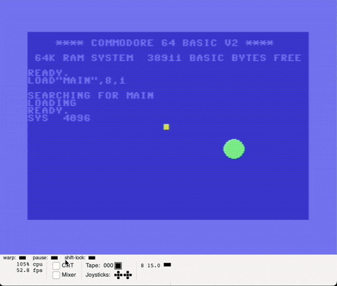
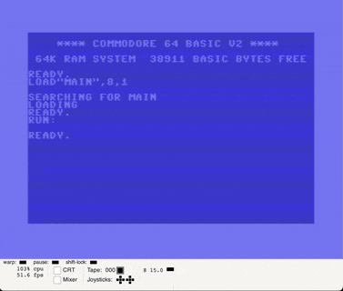
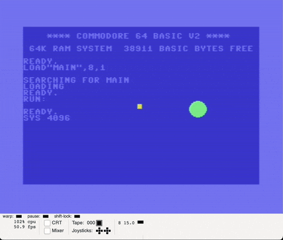

# Sprite circle v2, with fixed fixed-points arithmetics

## Tasks

* Make sine calculated in Q3.13 format
* Make multiplication/shifts work with negative values correctly

## Results

Q3.13 works now, with no visible effects compared to Q7.9

But sure there is visible effect if compared to broken Q3.13

