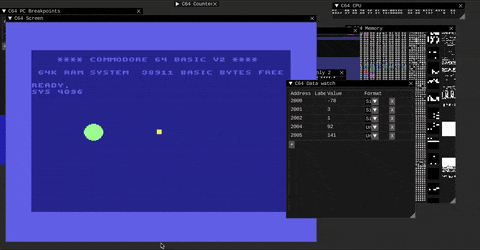
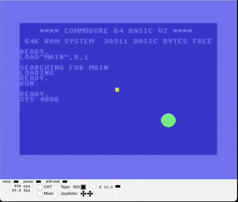

# Acceleration to center

## Tasks

* Make sprite accelerate to center, using one coordinate, velocity and acceleration

## Results

With integer computations and 8-bit positions

Sprite positions are kinda strangely-assembled 9-bit values with 9-th bit of all sprites stored in $D010, don't want to mess with it for now 

Acceleration is linear instead of actual [Gravitational_acceleration](https://en.wikipedia.org/wiki/Gravitational_acceleration)

### Extra

Same, but on both axis.
Some lags are visible, with V-Sync issues.

Lags are most likely dues to RetroDebugger interference in the different window