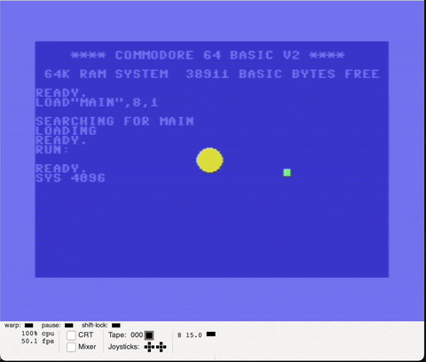

# Acceleration to center with more accurate gravitation application

## Tasks

* [Gravity law](https://en.wikipedia.org/wiki/Gravitational_acceleration) applied 

## Results

### Gravity law

#### Gravity field
`g = -1 * r * ((G * M) / d ^ 2)`

where:

* `M` is large mass,
* `d` is distance between masses 
* `r` is unit-vector

#### Attraction force

`F = m * g`

where:

* `m` is sample mass
* `g` is gravity field

#### Calculation

Without masses, just scale force with inverted distance square

Instead of direction vector distance vector is used, not normalized. Only works because later calculations in FP 

#### Result

Not quite there, but kinda close

Issues:
1. Looks like sometimes velocity is lost midair, some kind of glitch
2. Close to center of gravity there is extreme values not handled by the "clamp" function at the end of calculate func
3. Outer bounds also breaks force gravitational calculation