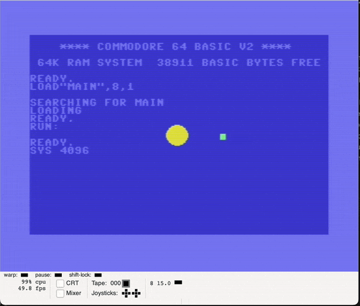

# Acceleration to center with gravity

## Tasks

* Fix glitches in previous implementation:
  1. Looks like sometimes velocity is lost midair, some kind of glitch
  2. Close to center of gravity there is extreme values not handled by the "clamp" function at the end of calculate func
  3. Outer bounds also breaks force gravitational calculation
  4. Clamp function not working correctly - too large minimum.

## Results

### Calculating gravity

Natively inverse distance vector by inverting subtract order
`distVector = bodyVect - centerVect`

became

`distVector = centerVect - bodyVect`

So, no need to store sign and inverse forces afterwards

Also, fixed-point formats tuned
### Negate function fixed

Two-complement func was incorrect with handling 16bit - add 1 was performed only on lsb, without carrying it to the msb