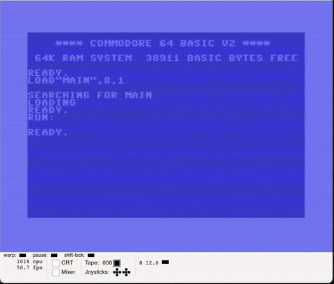
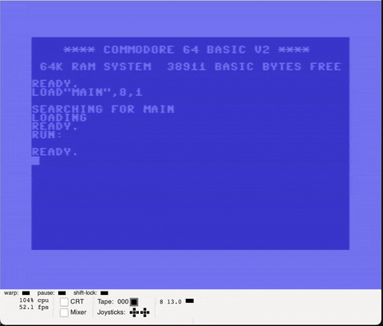
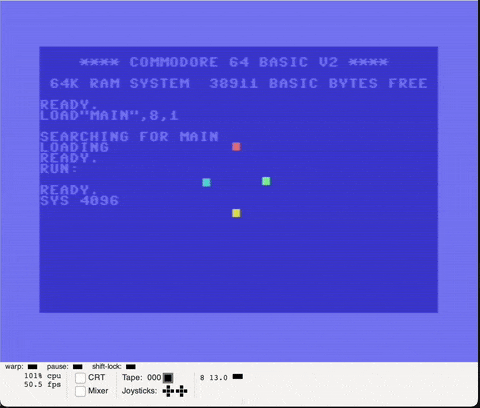

# Multi-body gravity (3 body test)

## Tasks

* Fix forces calculation - it interfere and cancels, only last one applied

## Results

### Before

Only one force per body, last one applied

### After

All forces applied. Some inaccuracies lead to overall movement to the top left corner
All masses are the same

### Bonuses

All masses are different, green body has the largest mass

## Next?

1. Bodies leaving screen. Camera tracking common mass center.
2. Better performance - all videos are 2x speed
3. Better library for bodies handling