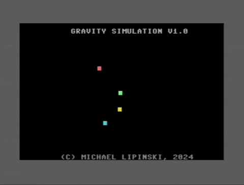

# More visual sugar

## Tasks

* Monotone background
* Paths rendering investigation - is it possible in real-time? In simulation-style execution?
* Some text on screen
  
    https://dustlayer.com/c64-coding-tutorials/2013/4/8/episode-2-2-writing-to-the-c64-screen

## Results

