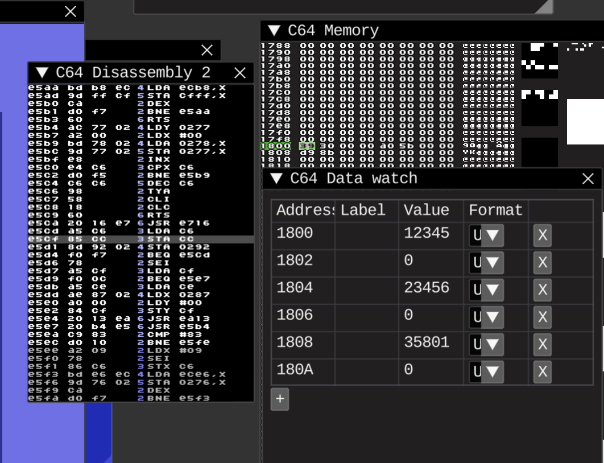

# Fixed point numbers



https://en.wikipedia.org/wiki/Fixed-point_arithmetic

Trying to calculate 12.345 + 23.456 = 35.801 here.

```asm
num1: .dword 12345
num2: .dword 23456
``` 

Fixed-point numbers are stored here with 2-byte for integer-part and 2-byte for fractional-part, handled as 32-bit integer, 

So, 16 bits(word), in used for integer part, and same amount for the fractional part, makes it fit about 65536.99999? Or is 65536.65536? Not sure about that, needs more research

UPD:
Wiki have some answers about max and min values, along with precision
https://en.wikipedia.org/wiki/Fixed-point_arithmetic#Choice_of_scaling_factors
https://en.wikibooks.org/wiki/Floating_Point/Fixed-Point_Numbers#Fixed-Point

There is base10 and base2 versions, and this here interpreted as base10, I suppose.

So, next is https://en.wikibooks.org/wiki/Floating_Point/Fixed-Point_Numbers#Sine_table
